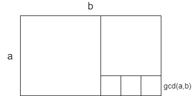

# ユークリッドの互除法 (Euclidean Algorithm)

## 概要

ユークリッドの互除法 (Euclidean Algorithm) は,
2つの自然数 x, y の最大公約数 $ gcd(x, y) $ を高速に求めるアルゴリズム.

x, y の最大公約数が求まれば最小公倍数 $ lcm(x, y) $ は $ lcm(x, y) = x / gcd(x, y) * y $ として直ちに求めることができる.

- 時間計算量: $ O(\log(min(x, y))) $

## 実装例

### C++ (再帰関数)

```cpp
typedef long long ll;

ll gcd(ll x, ll y) {
  return y ? gcd(y, x % y) : x;
}

ll lcm(ll x, ll y) {
  return x/gcd(x, y)*y;
}
```

### C++ (非再帰)

```cpp
typedef long long ll;

ll gcd(ll x, ll y) {
  while (y != 0) {
    ll r = x % y;
    x = y;
    y = r;
  }
  return x;
}

ll lcm(ll x, ll y) {
  return x/gcd(x, y)*y;
}
```

### Python3 (再帰関数)

```
def gcd(x, y):
    return x if y == 0 else gcd(y, x % y)

def lcm(x, y):
    return x//gcd(x, y)*y
```

### Python3 (非再帰)

```python
def gcd(x, y):
    while y != 0:
        x, y = y, x % y
    return x

def lcm(x, y):
    return x//gcd(x, y)*y
```

### Go (再帰)

```go
func gcd(x, y int64) int64 {
	if y == 0 {
		return x
	} else {
		return gcd(y, x%y)
	}
}

func lcm(x, y int64) int64 {
	return x / gcd(x, y) * y
}
```

### Go (非再帰)

```go
func gcd(x, y int64) int64 {
	for y != 0 {
		r := x % y
		x = y
		y = r
	}
	return x
}

func lcm(x, y int64) int64 {
	return x / gcd(x, y) * y
}
```
## 解説

### アルゴリズムの正当性の証明

ユークリッドの互除法は2つの自然数 x, y について, gcd(x, y) が gcd(y, x % y) に等しいことを利用し, 第二引数が 0 になるまで操作を繰り返すことで最大公約数を求めている.

gcd(x, y) が gcd(y, x % y) と等しいことを示してみる.

自然数 x, y について, x を y で割った商を q, 余りを r とすると

$$ x = q \times y + r $$

ここである自然数 d を y と r の両方を割り切ることができる, すなわち y と r の公約数であるとする.

このとき, d は qy + r = x も割り切ることができるため, x を割り切ることもできる. よって, d は x と y の公約数でもある.

ゆえに, ある自然数 d が y と r の公約数ならば d は x と y の公約数でもある.

次に, 逆を示す.

ある自然数 d が x と y の公約数であるとする.
このとき $x - q \times y = r$ も d で割り切れるので
d は y と r を割り切る.

ゆえに, ある自然数 d が x と y の公約数ならば d は y と r の公約数でもある.

以上のことから, x と y の公約数の集合は y と x % y の公約数の集合と等しいことが示され gcd(x, y) = gcd(y, x % y) も一致することが分かる.

### 最大公約数と最小公倍数の関係

2つの自然数 x, y の最大公約数を $ gcd(x, y) $, 最小公倍数を $ lcm(x, y) $ とすると次式が成り立つ.

$$ gcd(x, y) \times lcm(x, y) = xy $$

以下証明.

$ gcd(x, y) $ は x と y の最大公約数なので, x, y はそれぞれ, 互いに素な整数 $ x^{\prime}, y^{\prime} $
を用いて,

$$ x = gcd(x, y) \times x^{\prime} $$
$$ y = gcd(x, y) \times y^{\prime} $$

と置ける.

ここで, $ lcm(x, y) $ は x の倍数なので, $ lcm(x, y) = gcd(x, y) \times x^{\prime} \times k $ .

また, $ lcm(x, y) $ は y の倍数でもあるので, $ lcm(x, y) $ は
$ x^{\prime} \times k $ が $ y^{\prime} $ の倍数であるようなもののうち最小なるものである.

$ x^{\prime}, y^{\prime} $ が互いに素であるから, $ k = y^{\prime} $, すなわち,

$$ lcm(x, y) = gcd(x, y) \times x^{\prime} \times y^{\prime} $$

となる.

よって,

$$ xy = gcd(x, y)^2 \times x^{\prime} \times y^{\prime} $$

$$ gcd(x, y) \times lcm(x, y) = xy $$ 

となることが示された.

!!! warning
    $ gcd(x, y) \times lcm(x, y) = xy $ という関係式は3つ以上の自然数に対しては, 一般には成立しない.
    あくまでも 2 つの自然数について成り立つ等式である.

### 図形的な捉え方

最大公約数は幅, 高さがa, b の長方形を埋め尽くすことができるような正方形のなかで最大のものの一辺の長さに等しい.



上の画像のように長方形から正方形を切り落としていき最後に残った小さな正方形の一辺が gcd(a, b) となる.

### 標準ライブラリ

C++, Python3 ともに標準ライブラリに gcd を求める関数が存在する.

C++ では標準ヘッダである algorithm をインクルードすると,  `__gcd()` という関数が使え,
Python3 では version 3.6未満では math.gcd() がそれ以降では fractions.gcd() が使える.

標準ライブラリの gcd を使うと, バージョンによって import するモジュールがどれであるかを意識する必要が生じるため,
自前の実装を使うほうが良いかもしれない.

## 使用例

- [http://judge.u-aizu.ac.jp/onlinejudge/description.jsp?id=0005&lang=jp](http://judge.u-aizu.ac.jp/onlinejudge/description.jsp?id=0005&lang=jp)
    - [http://judge.u-aizu.ac.jp/onlinejudge/review.jsp?rid=3559003](http://judge.u-aizu.ac.jp/onlinejudge/review.jsp?rid=3559003) (C++, 再帰)
    - [http://judge.u-aizu.ac.jp/onlinejudge/review.jsp?rid=3559018](http://judge.u-aizu.ac.jp/onlinejudge/review.jsp?rid=3559018) (C++, 非再帰)
    - [http://judge.u-aizu.ac.jp/onlinejudge/review.jsp?rid=3559039](http://judge.u-aizu.ac.jp/onlinejudge/review.jsp?rid=3559039) (Python3, 再帰)
    - [http://judge.u-aizu.ac.jp/onlinejudge/review.jsp?rid=3559048](http://judge.u-aizu.ac.jp/onlinejudge/review.jsp?rid=3559048) (Python3, 非再帰)
    - [http://judge.u-aizu.ac.jp/onlinejudge/review.jsp?rid=3846091](http://judge.u-aizu.ac.jp/onlinejudge/review.jsp?rid=3846091) (Go, 再帰)
    - [http://judge.u-aizu.ac.jp/onlinejudge/review.jsp?rid=3846099](http://judge.u-aizu.ac.jp/onlinejudge/review.jsp?rid=3846099) (Go, 非再帰)

- [https://atcoder.jp/contests/abc070/tasks/abc070_c](https://atcoder.jp/contests/abc070/tasks/abc070_c)
    - [https://atcoder.jp/contests/abc070/submissions/5339951](https://atcoder.jp/contests/abc070/submissions/5339951) (C++, 再帰)
    - [https://atcoder.jp/contests/abc070/submissions/5370947](https://atcoder.jp/contests/abc070/submissions/5370947) (C++, 非再帰)
    - [https://atcoder.jp/contests/abc070/submissions/5370969](https://atcoder.jp/contests/abc070/submissions/5370969) (Python3, 再帰)
    - [https://atcoder.jp/contests/abc070/submissions/5370978](https://atcoder.jp/contests/abc070/submissions/5370978) (Python3, 非再帰)
    - [https://atcoder.jp/contests/abc070/submissions/7323272](https://atcoder.jp/contests/abc070/submissions/7323272) (Go, 再帰)
    - [https://atcoder.jp/contests/abc070/submissions/7323252](https://atcoder.jp/contests/abc070/submissions/7323252) (Go, 非再帰)

## 関連する問題

- [https://atcoder.jp/contests/abc125/tasks/abc125_c](https://atcoder.jp/contests/abc125/tasks/abc125_c)

- [https://atcoder.jp/contests/agc001/tasks/agc001_b](https://atcoder.jp/contests/agc001/tasks/agc001_b)

- [https://codeforces.com/contest/1203/problem/C](https://codeforces.com/contest/1203/problem/C)

## 参考文献

- 蟻本

- [https://ja.wikipedia.org/wiki/ユークリッドの互除法](https://ja.wikipedia.org/wiki/%E3%83%A6%E3%83%BC%E3%82%AF%E3%83%AA%E3%83%83%E3%83%89%E3%81%AE%E4%BA%92%E9%99%A4%E6%B3%95)

- [https://mathtrain.jp/abequalgl](https://mathtrain.jp/abequalgl)

